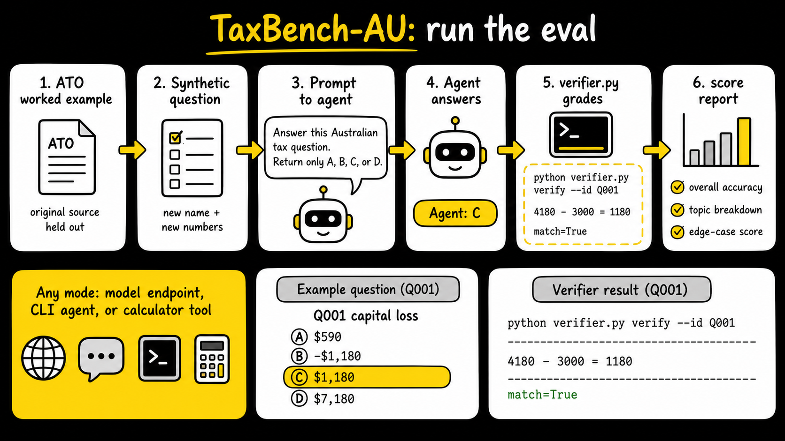

# TaxBench-AU

TaxBench-AU is a 156-question benchmark for testing whether AI agents can calculate Australian tax.

Each item is a multiple-choice Australian tax calculation question. The questions in the published dataset use new names and numbers to original ATO worked examples. This is to prevent agents with web search from cheating. Each answer is checked by a python script.

[Paper](paper/PAPER.pdf) · [Hugging Face dataset](https://huggingface.co/datasets/Pn101/taxbench-au) · [Kaggle mirror](https://www.kaggle.com/datasets/poonam101test/australian-tax-mcq-benchmark)



## What is included

```text
data/question.csv     questions only, no answers
data/answer.csv       answer key, explanations, verifier formulas, source URLs
data/exam.csv         questions + answers + metadata in one file
verifier.py           grade answers, verify a case, or act as a calculator tool
scripts/run_eval.py   run the benchmark against a model endpoint or CLI agent
skills/taxbench-au/   small agent skill for running and reporting evals
paper/PAPER.pdf       short paper
paper/PAPER.tex       LaTeX source for the paper
figures/paper/*.png   images used by the paper
```

The 156 questions cover CGT, rental property, depreciation, FBT, individual income tax and offsets, superannuation, Division 7A and franking, GST, study and training loans, income tests, and employment and termination payments.

## Agent skill

Agent instructions live at [`skills/taxbench-au/SKILL.md`](skills/taxbench-au/SKILL.md).

## Quick start

No package install is required for the built-in verifier and runner.

```bash
git clone https://github.com/poonamsnair/taxbench-au.git
cd taxbench-au

# Recompute one stored answer.
python3 verifier.py verify --id Q001

# Use the safe calculator directly.
python3 verifier.py calc "(880000 - 615000) * 0.5"
```

Expected Q001 verifier output includes:

```text
Q001: reduced_cost_base - capital_proceeds
params={'reduced_cost_base': 4180, 'capital_proceeds': 3000}
verifier -> 1180   stated answer -> 1180.0 (C)   match=True
```

## Prompt given to agents

`scripts/run_eval.py` sends this prompt for each row:

```text
Answer this Australian tax question.
Return only A, B, C, or D.

{question}
```

Use this default prompt for comparable scores. Custom prompts are allowed, but label them as custom-prompt runs (`--prompt-template`).

Tool access is part of the run setup. Report whether web, tax databases, or calculator tools were allowed.

## Prevent answer-key access

Prompt instructions are not a security boundary. A CLI agent with filesystem tools can cheat if it can read `data/answer.csv` or `data/exam.csv`.

For CLI agents, `scripts/run_eval.py` runs the command from a temporary working directory by default. That directory contains no answer key. If you allow calculator use, pass `--expose-calculator`; this copies `verifier.py` into the temporary directory so the agent can run `python3 verifier.py calc`, but it still does not receive `data/answer.csv` or `data/exam.csv`.

Do not set `--agent-cwd` to the repo root for a serious benchmark run. For stronger isolation, run the agent inside a container or VM that only contains the prompt, optional calculator, and no answer key.

## Run an OpenAI-compatible endpoint

The runner calls `/chat/completions` using only the Python standard library.

```bash
export OPENAI_API_KEY=...
export OPENAI_MODEL=gpt-4o-mini

python3 scripts/run_eval.py --openai --limit 5 --out runs/openai_answers.csv
```

For a local or hosted OpenAI-compatible endpoint:

```bash
export OPENAI_BASE_URL=http://localhost:11434/v1
export OPENAI_API_KEY=dummy
export OPENAI_MODEL=your-model

python3 scripts/run_eval.py --openai --limit 5 --out runs/local_answers.csv
```

Run the full set by removing `--limit 5`.

## Run Claude Code, Codex, or any CLI agent

```bash
python3 scripts/run_eval.py \
  --command 'your-agent-command-that-prints-one-letter' \
  --limit 5 \
  --out runs/cli_answers.csv
```

Examples you can adapt:

```bash
# If your Claude Code CLI supports print mode:
python3 scripts/run_eval.py --command 'claude -p "$TAXBENCH_PROMPT"' --limit 5

# Codex CLI:
python3 scripts/run_eval.py --command 'codex --ask-for-approval never exec --skip-git-repo-check --color never --ephemeral --sandbox read-only -C "$PWD" -' --limit 5
```

## Grade an existing answer file

Create a CSV with at least `id,answer`:

```csv
id,answer
Q001,C
Q002,A
```

Then grade it:

```bash
python3 verifier.py grade runs/my_answers.csv
```

The report prints overall accuracy and per-topic accuracy.

## Let an agent call the calculator

Agents can call the calculator as a tool while solving:

```bash
python3 verifier.py calc "(880000 - 615000) * 0.5"
```

They can also recompute any benchmark answer:

```bash
python3 verifier.py verify --id Q001
```

That separates two skills: choosing the right tax rule and doing the arithmetic.

## Licences and attribution

- Benchmark items, documentation, and metadata: [CC BY 4.0](LICENSE-CC-BY-4.0)
- Verifier and scripts: [MIT](LICENSE-MIT)
- ATO source materials referenced by URL remain © Australian Taxation Office. See [NOTICE](NOTICE).

This project is not affiliated with, endorsed by, or sponsored by the Australian Taxation Office, the Commonwealth of Australia, or the Tax Practitioners Board.
